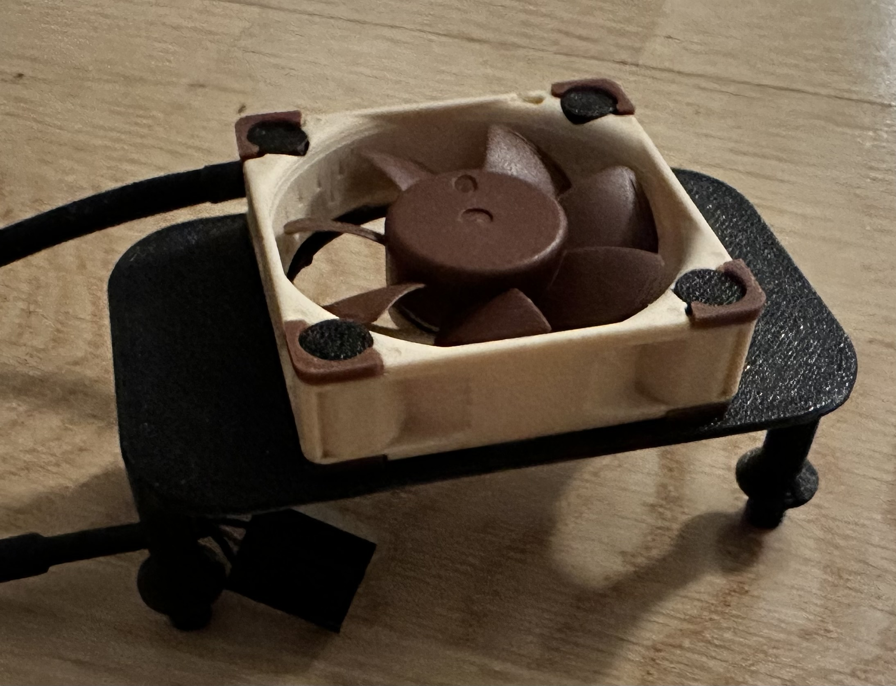

### Fan mount 3D models
These STEP files are made specifically for the 40x40x10mm Noctua fan, and should be 3D-printed using a rather small layer height to make sure the threads are sufficiently detailed.

  

