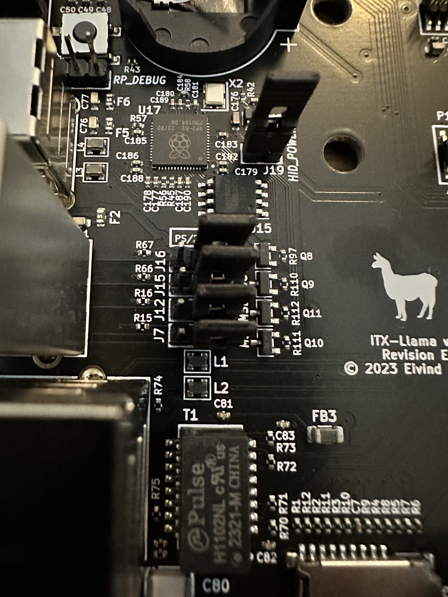

# Flash

How to update the RP2040 USB to PS/2 converter on the ITX-Llama:

You will need a USB-A to USB-A cable and another PC or Mac.

1. remove the jumper **J19** HID_POWER
2. hold down the button **SW3** between the white USB ports and the CMOS battery
3. while holding **SW3** connect another PC or Mac to the **lower white USB port**
4. a flash drive named **RPI-RP2** appears, drag the latest release file onto it: [itxllama-rp2040.uf2](https://github.com/eivindbohler/itxllama/raw/refs/heads/main/rp2040/build/itxllama-rp2040.uf2)
5. disconnect the USB cable
6. reinstall the jumper **J19** HID_POWER

  

